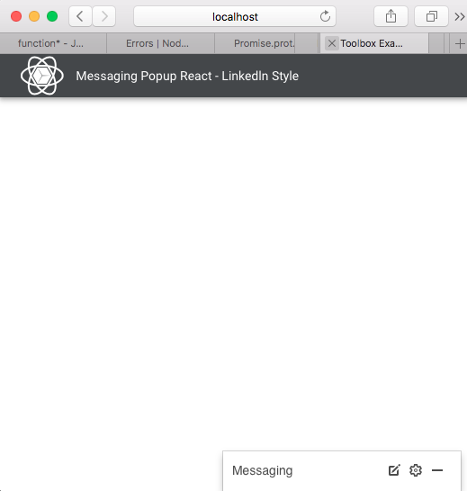
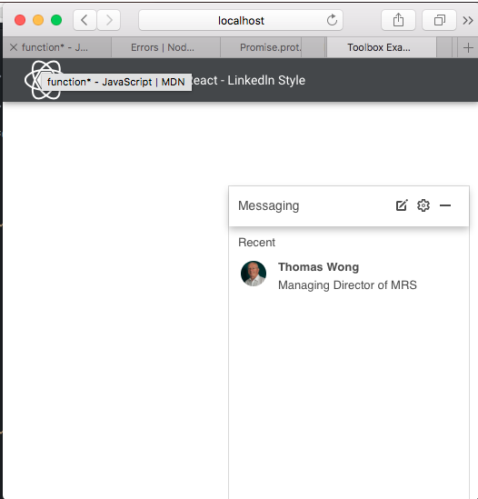
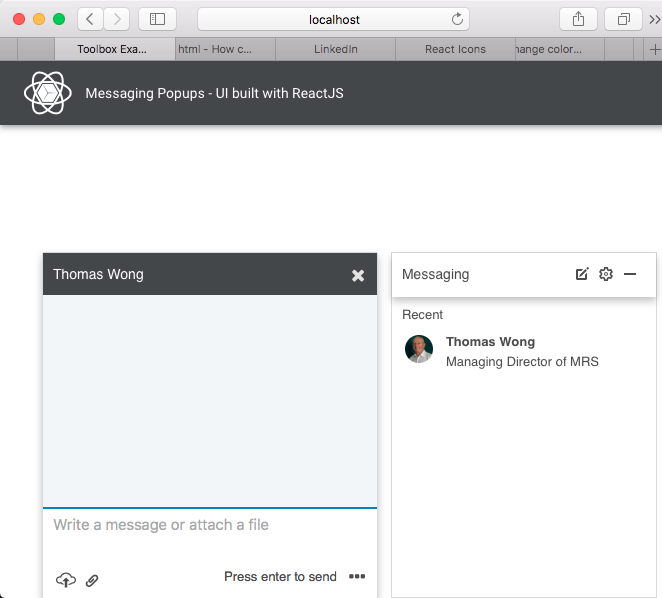

One afternoon, I surfed Linkedln site, and I got a message popup. Impressed, so here I build the components using ReactJS

- The initial floating message popup at the bottom right corner of the page

- The floating message popup is opened with the list of recent contacts

- The chat message popup is open

### The rest will come soon
