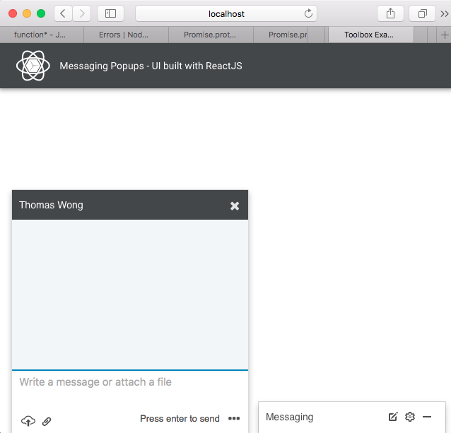

On Anzac day, I surfed Linkedln site, and I got a message popup. Impressed, so here I build the components using ReactJS. Pure components, handcrafted, just using HTML5 & CSS. Nice animation transition of the Messaging Popup window when it is minimized and opened, like what you see on Linkedln. Borrowed some svg icons from Linkedln

- The initial floating message popup at the bottom right corner of the page

- The floating message popup is opened with the list of recent contacts

- The chat message popup is open

- The main floating message can be minimized, while the other popup is open

### Getting Started
1. Clone this repository
2. Run `npm install && npm start`
3. Visit `0.0.0.0:8080` in your browser

### New things I learnt
1. PostCss - nice way to use css module as a javascript object from React component
2. Understand more about Flexbox model. Trying to use it more efficiently to layout web components
